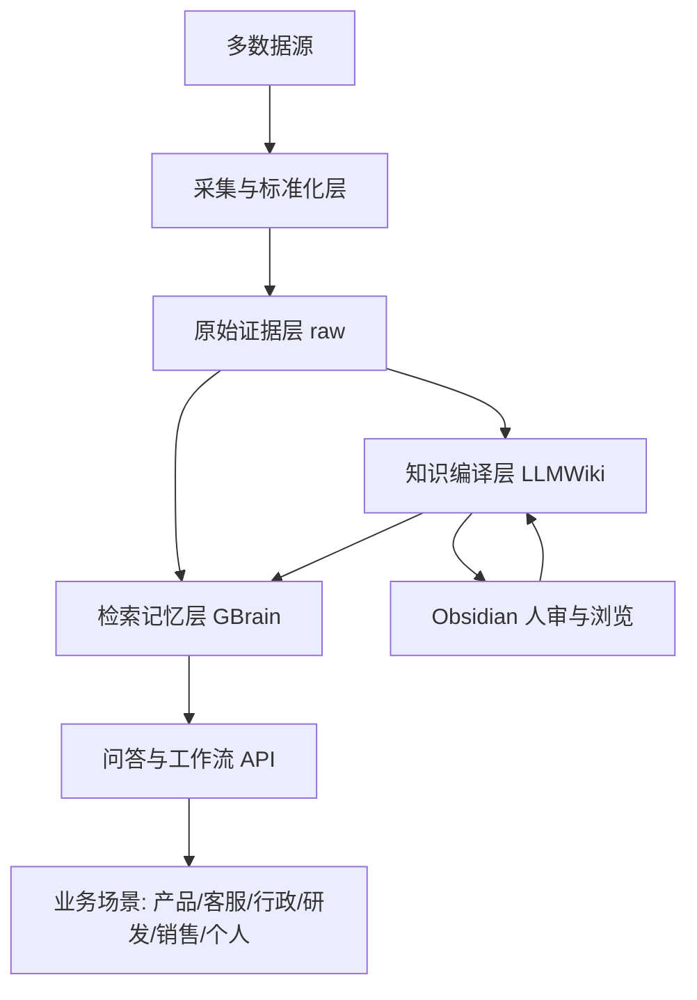
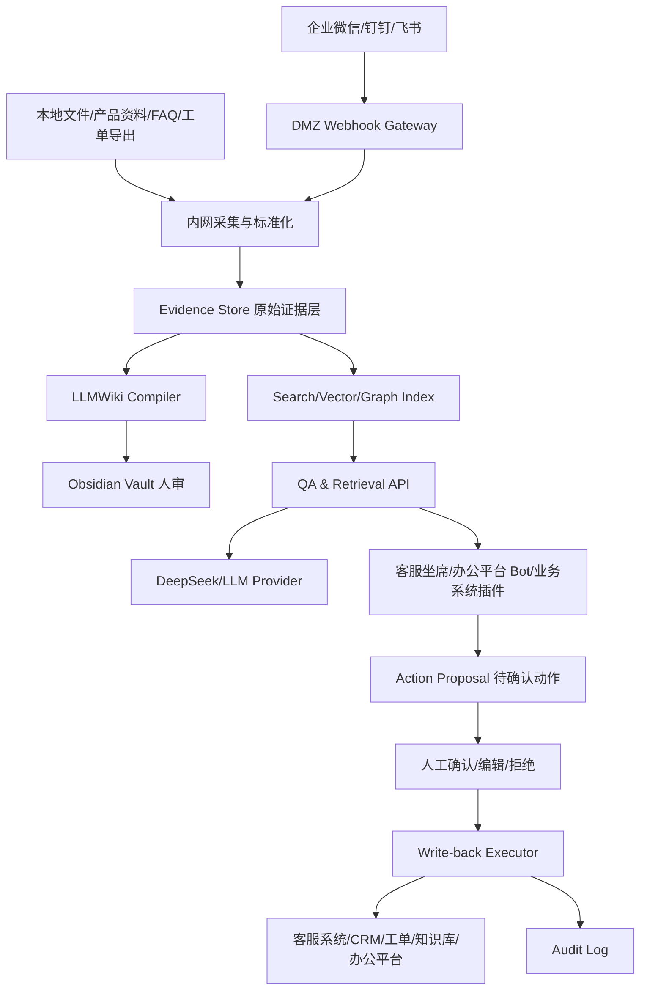
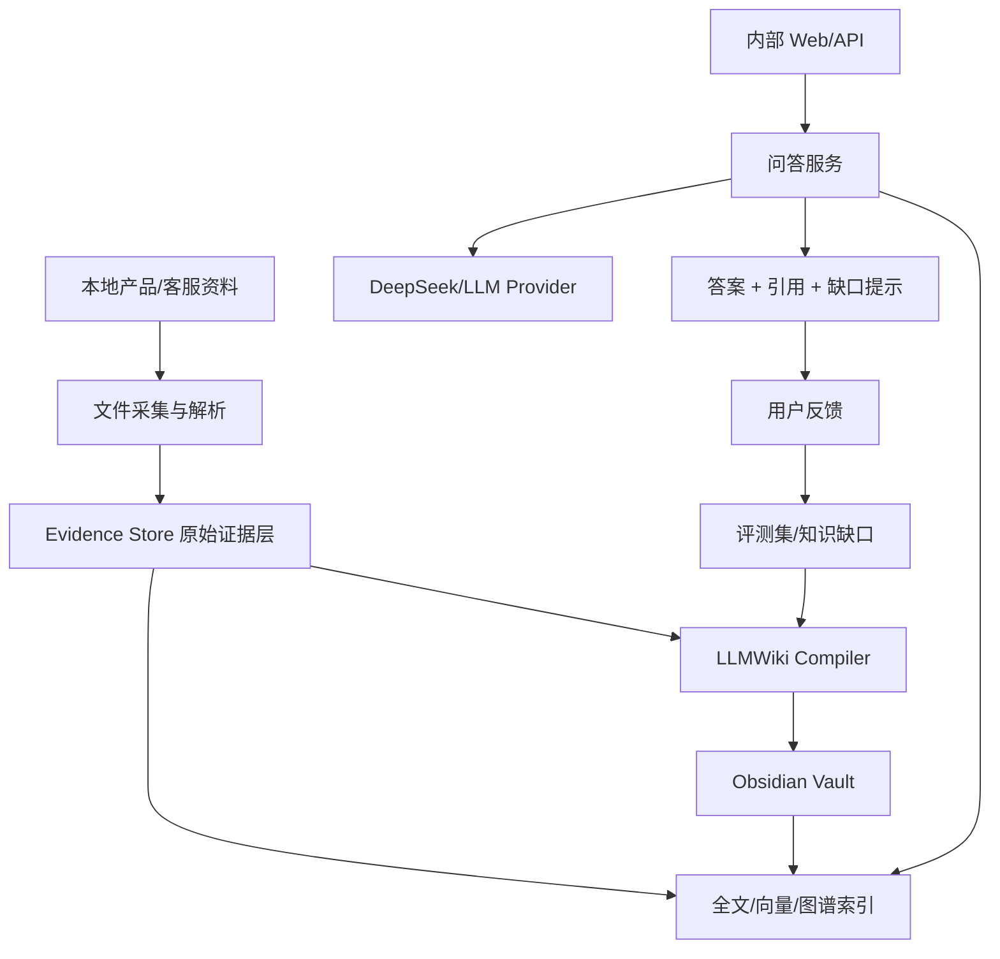

## 2026-06-28 23:43

## 技术方案概述

本方案评估使用 LLMWiki + GBrain + DeepSeek + Obsidian 构建“自有多数据源知识库”的可行性。结论是：方案可行，尤其适合公司内部知识、产品知识、客服知识、行政制度、研发资料、销售与客户资料、个人研究等持续积累型场景；但必须把“原始资料、LLM 生成知识、检索记忆、人审界面、权限审计”分层，否则容易变成一个看似聪明但不可追溯、不可治理的知识黑盒。

推荐定位为：原始数据是唯一事实源，LLM 负责把资料增量编译成可读、可链接、可审查的 Markdown 知识库；GBrain 负责运行时检索、图谱关系、记忆和 agent 操作；DeepSeek 作为可替换的大模型推理后端；Obsidian 作为人类浏览、校对、链接和轻量协作的知识库 IDE。

## 技术选型

| 类别 | 选择 | 理由 |
|------|------|------|
| 知识组织模式 | LLMWiki | 适合把原始资料沉淀为 LLM 维护的 Markdown wiki，包含 raw、wiki、schema、index、log、lint 等工作流。 |
| 检索/记忆层 | GBrain | 适合作为 agent 的长期记忆、检索、图谱遍历、差距分析和多源知识入口；但应作为可替换组件接入，避免锁死。 |
| LLM 后端 | DeepSeek API | API 兼容 OpenAI/Anthropic 风格，适合批量总结、抽取、问答和低成本推理；需做模型名和供应商抽象。 |
| 人审/编辑界面 | Obsidian | 基于本地 Markdown vault，天然适配 LLMWiki 的文件结构、双链、图谱视图、Dataview、Git 版本管理。 |
| 源数据存储 | 原始文件 + 对象存储/文件系统 + Git | 原始资料不可被 LLM 修改，保留可追溯证据、哈希、来源、采集时间和权限信息。 |
| 结构化索引 | SQLite/Postgres + pgvector 可选 | 小规模先用文件索引和全文搜索；中大型团队再接 Postgres/pgvector、BM25、reranker。 |
| 后端服务 | Python/FastAPI 或 Node.js/NestJS | 取决于团队熟悉度；Python 对文档解析、LLM pipeline 和数据处理更顺手。 |

## 架构设计

建议采用五层架构：



核心原则：

1. 原始资料不可变：PDF、Word、PPT、网页、工单、会议纪要、聊天记录、CRM 记录等进入 raw 层后只追加、不覆盖。
2. Wiki 是衍生物：LLM 可以创建和更新 wiki 页面，但每个关键结论必须能回链到 source_id、原文片段和更新时间。
3. GBrain 是运行时能力：承担检索、实体关系、记忆压缩、差距发现、定时任务，不应成为唯一事实源。
4. Obsidian 是人类工作台：让用户看到知识网络、修改页面、标记错误、补充上下文，不承担权限和审计核心职责。
5. DeepSeek 是模型实现：通过统一 LLM Provider 接口接入，避免后续切换模型或混合模型时大改架构。

## 模块划分

| 模块 | 职责 | 依赖 |
|------|------|------|
| Source Connector | 接入文件夹、网页、飞书/钉钉、企业微信、邮箱、CRM、客服工单、数据库等数据源 | 外部系统 API |
| Normalizer | 文档解析、OCR、语音转写、Markdown/JSONL 标准化、元数据清洗 | Source Connector |
| Evidence Store | 保存原始资料、source_id、hash、采集时间、权限标签、版本 | Normalizer |
| Wiki Compiler | 根据 LLMWiki 规则生成摘要页、实体页、概念页、对比页、index、log | Evidence Store、LLM Provider |
| GBrain Adapter | 把来源、wiki 页面、实体关系写入 GBrain，并提供查询/图谱/记忆调用 | Evidence Store、Wiki Compiler |
| LLM Provider | 封装 DeepSeek 调用，支持 thinking、stream、重试、限流、成本统计 | DeepSeek API |
| Query API | 面向业务系统和用户提供问答、检索、引用、反馈接口 | GBrain Adapter、Wiki Compiler |
| Review Workflow | 人审队列、敏感内容确认、错误反馈、知识页审批 | Obsidian、Query API |
| Governance | 权限、审计、脱敏、保留策略、删除同步、访问日志 | 全模块 |

## 接口设计

### 接口1：提交数据源入库

接口名称：提交数据源入库  
请求方式：POST  
请求路径：/api/sources/ingest  
请求参数：

- source_type (string, 必填): file/web/ticket/email/meeting/db 等
- uri (string, 可选): 文件路径或外部系统地址
- content (string, 可选): 已抽取文本
- metadata (object, 必填): 标题、作者、部门、时间、权限标签、业务域
- immutable (boolean, 可选): 是否写入不可变证据层，默认 true

响应格式：

```json
{
  "code": 0,
  "data": {
    "source_id": "src_20260628_0001",
    "status": "queued"
  }
}
```

### 接口2：触发 Wiki 编译

接口名称：触发 Wiki 编译  
请求方式：POST  
请求路径：/api/wiki/compile  
请求参数：

- source_ids (array, 必填): 待处理原始资料 ID
- domain (string, 必填): product/customer_service/admin/research 等
- mode (string, 可选): incremental/full
- human_review_required (boolean, 可选): 是否需要人审

响应格式：

```json
{
  "code": 0,
  "data": {
    "job_id": "job_compile_0001",
    "updated_pages": [],
    "review_required": true
  }
}
```

### 接口3：知识库问答

接口名称：知识库问答  
请求方式：POST  
请求路径：/api/ask  
请求参数：

- question (string, 必填): 用户问题
- domain (string, 可选): 限定业务域
- user_id (string, 必填): 用于权限过滤
- require_citations (boolean, 可选): 是否强制引用来源，默认 true
- answer_mode (string, 可选): short/report/action_plan

响应格式：

```json
{
  "code": 0,
  "data": {
    "answer": "基于已授权资料的回答",
    "citations": [
      {
        "source_id": "src_20260628_0001",
        "page": "wiki/product/xxx.md",
        "snippet": "原文片段摘要"
      }
    ],
    "confidence": "medium",
    "missing_info": []
  }
}
```

### 接口4：知识库健康检查

接口名称：知识库健康检查  
请求方式：POST  
请求路径：/api/wiki/lint  
请求参数：

- domain (string, 可选): 检查范围
- checks (array, 可选): contradiction/orphan/stale/missing_citation/permission_leak

响应格式：

```json
{
  "code": 0,
  "data": {
    "issues": [
      {
        "type": "stale",
        "page": "wiki/customer_service/refund_policy.md",
        "severity": "high",
        "suggestion": "发现新制度与旧页面冲突，需要更新"
      }
    ]
  }
}
```

## 数据模型

### Source

| 字段 | 类型 | 说明 |
|------|------|------|
| id | string | 原始资料唯一 ID |
| source_type | string | 文件、网页、工单、会议、邮件、数据库等 |
| title | string | 标题 |
| uri | string | 来源路径或外部链接 |
| content_hash | string | 内容哈希，用于去重和审计 |
| collected_at | datetime | 采集时间 |
| effective_at | datetime | 内容生效时间，如制度发布日期 |
| owner | string | 资料负责人 |
| domain | string | 业务域 |
| acl | json | 权限标签 |
| raw_path | string | 原始文件保存位置 |

### WikiPage

| 字段 | 类型 | 说明 |
|------|------|------|
| path | string | Markdown 页面路径 |
| page_type | string | summary/entity/concept/comparison/index/log |
| title | string | 页面标题 |
| source_ids | array | 关联原始资料 |
| last_compiled_at | datetime | 最近一次 LLM 编译时间 |
| review_status | string | draft/reviewed/rejected |
| owner | string | 页面负责人 |

### Entity

| 字段 | 类型 | 说明 |
|------|------|------|
| id | string | 实体 ID |
| name | string | 实体名称 |
| entity_type | string | person/company/product/policy/customer/project |
| aliases | array | 别名 |
| source_ids | array | 证据来源 |
| wiki_page | string | 对应实体页 |

### QueryLog

| 字段 | 类型 | 说明 |
|------|------|------|
| id | string | 查询 ID |
| user_id | string | 提问用户 |
| question | string | 问题 |
| retrieved_sources | array | 检索到的资料 |
| answer_hash | string | 回答哈希 |
| feedback | string | 用户反馈 |
| created_at | datetime | 查询时间 |

## 关键设计决策

| 决策点 | 选择 | 理由 |
|--------|------|------|
| 谁是事实源 | 原始资料 raw 层 | 避免 LLM 生成内容污染事实；便于审计和追责。 |
| LLMWiki 与 GBrain 的关系 | LLMWiki 做可读知识产物，GBrain 做运行时检索与记忆 | 两者互补，不应互相覆盖事实源。 |
| 是否一开始就做完整前端 | 暂不做，先用 Obsidian + API | 先验证知识质量和流程价值，降低 MVP 成本。 |
| 是否自动回答客户 | 初期只做坐席辅助或内部问答 | 客服外发内容需要审批、置信度和升级机制。 |
| 是否所有资料都进库 | 分域、分级、分权限接入 | 避免权限泄露和无效噪声，优先高价值高频资料。 |
| 是否绑定 DeepSeek | 不绑定，做 Provider 抽象 | DeepSeek 可作为默认模型，但模型名、价格和能力会变化。 |
| 是否依赖向量库 | 小规模可不用，中大型再引入混合检索 | Markdown index + 全文检索足够支撑早期验证；规模化再加 pgvector/BM25/reranker。 |
| 是否允许 LLM 直接改 Obsidian 页面 | 允许改 wiki 衍生层，不允许改 raw 层 | 保持可读可改，同时保护证据层。 |

## 可行性判断

### 适合的场景

1. 公司产品知识库：PRD、版本说明、FAQ、售前资料、竞品分析、客户反馈、缺陷记录。
2. 客服与售后：工单归因、标准话术、政策查询、问题复盘、知识缺口发现。
3. 行政与制度：公司制度、流程、资产、采购、报销、会议纪要、通知归档。
4. 研发与项目：需求、接口文档、架构方案、故障复盘、代码说明、发布记录。
5. 销售与客户成功：客户档案、沟通纪要、商机阶段、竞品异议、解决方案沉淀。
6. HR 与培训：员工手册、岗位说明、培训材料、面试题库、入职知识地图。
7. 个人研究/学习：论文、课程、书籍、网页剪藏、长期主题研究。

### 不适合直接上线的场景

1. 高风险自动决策：法律、医疗、财务审批、劳动关系处罚等不能仅靠 LLM 自动判断。
2. 强实时业务系统：库存、订单、交易状态等应以业务数据库为准，知识库只能解释和辅助。
3. 权限复杂且没有统一身份体系的组织：容易出现跨部门资料泄露。
4. 没有资料负责人和人审流程的团队：知识会快速变旧，错误也难以纠正。

### 最大难点

1. 数据接入比模型调用更难：PDF、图片、表格、聊天记录、工单、数据库字段的清洗成本高。
2. 权限治理比检索更难：问答时必须按用户权限过滤 source、wiki page、entity 和引用。
3. 知识一致性需要持续 lint：新制度、新版本、新客户反馈会推翻旧结论。
4. 评价体系必须前置：没有 golden questions、引用准确率、拒答率、人工满意度，就无法判断是否真的有用。
5. Obsidian 适合人审，不适合作为企业级权限后端：企业级权限、审计、审批要在服务端实现。

## 推荐 MVP

第一阶段不要一次性覆盖所有部门，建议选一个“高频问题 + 资料相对集中 + 有明确负责人”的试点域，例如：

- 产品知识 + 客服辅助：PRD、FAQ、版本记录、历史工单、售后政策。
- 行政制度问答：制度文档、报销流程、采购流程、办公规范。

MVP 范围：

1. 接入 100-300 份高价值资料。
2. 建立 Obsidian vault：raw、wiki、schema、index.md、log.md、reviews。
3. 用 DeepSeek 完成摘要、实体抽取、页面更新、问答生成。
4. 先实现文件级权限和人工 review，不做复杂部门矩阵。
5. 准备 50-100 个真实问题作为评测集。
6. 输出回答必须带引用；找不到依据时必须拒答或提示缺口。
7. 每周跑一次 lint，检查过期页面、孤立页面、无引用结论、冲突政策。

验收指标：

| 指标 | 目标 |
|------|------|
| 引用准确率 | >= 90% |
| 常见问题命中率 | >= 80% |
| 无依据拒答率 | 可解释且可追踪 |
| 人工修订率 | 首期可高，后续持续下降 |
| 资料更新延迟 | 试点期 T+1，可逐步接近实时 |
| 权限误漏 | 0 容忍 |

## 实现计划

1. 需求边界确认：确定第一个试点域、资料来源、用户角色、权限边界、典型问题。
2. Vault 结构搭建：创建 raw、wiki、schema、logs、reviews、assets 目录和页面命名规范。
3. 数据接入脚本：先支持本地文件夹、Markdown、PDF、Word、网页剪藏，再扩展企业系统。
4. DeepSeek Provider：封装模型调用、流式输出、重试、限流、成本日志、模型名配置。
5. LLMWiki 编译器：实现 ingest、query、lint 三个核心工作流。
6. GBrain 集成：将 source、wiki page、entity、关系写入检索记忆层，评估与简单全文检索的效果差异。
7. 问答 API：返回答案、引用、置信度、缺口和反馈入口。
8. 人审流程：Obsidian 中审阅页面，服务端记录 review 状态和反馈。
9. 评测集建设：沉淀真实问题、标准答案、允许引用、拒答规则。
10. 试点复盘：根据命中率、引用准确率、人工修订率决定是否扩大到客服/行政/销售/研发等更多场景。

## 近期技术注意点

1. DeepSeek 当前官方文档显示 API 兼容 OpenAI/Anthropic 风格，并且 `deepseek-chat`、`deepseek-reasoner` 将在 2026-07-24 15:59 UTC 弃用，方案中不要写死旧模型名。
2. GBrain 截至 2026-06-28 仍属于快速演进项目，适合试点和研究，但生产系统应保留替换接口。
3. LLMWiki 是工作流模式，不是现成平台；真正的工程量在数据清洗、schema 约束、权限、评测和持续维护。
4. Obsidian 的优势是本地 Markdown、双链和图谱视图；企业级多人权限、审计和审批不能只依赖 Obsidian 插件。

## 待讨论问题

1. 第一阶段优先做哪个域：产品/客服、行政制度、研发项目，还是个人知识库？
2. 数据源有哪些：本地文件、企业微信/钉钉/飞书、邮箱、工单系统、CRM、数据库、网页？
3. 部署模式：完全本地、内网服务器、云端 API，还是混合？
4. 权限粒度：个人、部门、项目、客户、资料级，是否已有统一登录体系？
5. 是否允许自动写回业务系统，还是只允许写入 wiki 和生成建议？

## 参考资料

- Karpathy LLMWiki: https://gist.github.com/karpathy/442a6bf555914893e9891c11519de94f
- GBrain: https://github.com/garrytan/gbrain
- DeepSeek API Docs: https://api-docs.deepseek.com/
- Obsidian Markdown Import: https://obsidian.md/help/import/markdown
- Obsidian Data Storage: https://obsidian.md/help/data-storage

方案已设计完成，可使用 `代码实现` 进入下一阶段。

---
## 2026-06-30 21:27

## 检索泛化后续优化执行补充

### 本轮追加执行

1. 评测 CLI 增加单题定位能力：
   - `--question-id` 支持重复传入指定题号。
   - `--limit` 支持截取筛选后的前 N 题。
   - domain 过滤在 limit 之前执行，避免 `--domain customer_service --limit 1` 被 Q01 截断为空结果。
2. 评测 CLI 增加逐题进度输出：
   - 输出格式：`[off] Q20 PASS 3297.12ms (1/1)`。
   - both 模式会分别输出 `[off]` 和 `[on]` 进度，便于定位卡顿题和失败题。
3. `app.eval.run_upgraded_eval()` 增加 `progress_callback` 和 `mode_label`，不改变既有 API 返回结构。
4. Failure diff Markdown 增加 OFF/ON 细节：
   - 每个差异题展示 matched sources、matched terms、GBrain candidates 和 GBrain hits。
   - 报告可直接用于区分本地召回失败、GBrain 候选噪声、GBrain context 干扰等问题。
5. 新增测试覆盖：
   - CLI failure diff Markdown 渲染。
   - 质量门禁失败退出码。
   - `--question-id`、`--limit` 传递给内置评测。
   - domain 过滤与 limit 的顺序。
   - eval progress callback。

### 最新验证证据

| 检查项 | 结果 |
|--------|------|
| `python -m pytest -q` | `54 passed, 4 skipped in 48.79s` |
| `py_compile` | 通过 |
| intent helper 搜索 | 无命中 |
| 200/300 分 boost 搜索 | 无命中 |
| Q20 单题 CLI | `PASS`，落盘 `output/upgraded_qa_benchmark/20260630_212457` |
| 质量门禁失败路径 | exit code `1`，落盘 `output/upgraded_qa_benchmark/20260630_212610` |

### 当前结论

1. P0 硬编码清理已完成：6 个测试题专用 intent helper 已无命中，残留题面短语 boost 已从关键 boost 函数移除。
2. P1 评测内置化已增强：ON/OFF `failure_diff`、质量门禁退出码、单题筛选和逐题进度均已具备。
3. Q20 可通过单题 CLI 快速复现；Q21 仍需要从 `entity_aliases` 数据和跨制度文档召回继续优化。
4. GBrain ON 当前仍不是默认收益项，必须继续用 diff 和详细 hit 诊断解释 ON 少过的题。

### 后续执行计划

1. P1：为 GBrain diff 增加失败标签：候选噪声、GBrain 无命中、GBrain 命中低质、LLM 被无关 context 干扰、评分规则误判。
2. P1：补单题超时参数，避免 both 模式被单个慢题拖住。
3. P1：继续补 `entity_aliases` 的角色/审批别名，重点覆盖 Q21 的部门总监、负责人、直属主管、审批人等称谓。
4. P2：把剩余通用 `contextual_boost()` 信号迁移到配置化 retrieval feature，并输出命中原因。

---
## 2026-06-30 21:40

## Q20/Q21 修复执行记录

### 根因

Q20 已能通过；Q21 的真实失败点不是缺少新的 reranker 题面规则，而是默认实体别名没有稳定进入运行时检索：

1. 代码中已有 `DEFAULT_ENTITY_ALIASES`，但旧 PostgreSQL 库里存在遗留唯一索引 `idx_entity_aliases_domain_alias`。
2. 该旧索引只允许同一 domain 下一个 alias_key 出现一次，阻止 `部门总监` 同时映射到 `部门负责人`、`直属上级`、`审批人`。
3. `ask()` 对 alias 扩展异常做了降级，导致异常被吞掉后 `matched_aliases=[]`，Q21 检索被泛词带偏到工单资料。

### 已执行修复

1. `app/db.py`：schema 初始化时显式删除旧索引 `idx_entity_aliases_domain_alias`。
2. `app/aliases.py`：`expand_query_with_aliases()` 前幂等执行默认别名 seed，并按数据库配置做轻量缓存。
3. `tests/test_acl_and_aliases.py`：新增默认别名自动 seed 测试，以及旧索引兼容回归测试。
4. 继续保留 `entity_aliases` 表作为 Q21 的解决路径，不新增“部门总监”题面 boost。

### 最新验证

| 检查项 | 结果 |
|--------|------|
| Q21 单题 | `PASS`，报告 `output/upgraded_qa_benchmark/20260630_213830` |
| Q20+Q21 | `2/2 PASS`，报告 `output/upgraded_qa_benchmark/20260630_213846` |
| `python -m pytest -q` | `56 passed, 4 skipped in 48.31s` |
| `py_compile` | 通过 |
| intent helper 搜索 | 无命中 |
| 200/300 分 boost 搜索 | 无命中 |

### 后续计划调整

1. Q21 别名数据补齐从待办改为已完成基础修复。
2. 后续重点转向单题超时、failure diff 失败标签和 retrieval feature 配置化。
3. GBrain ON 当前仍需作为可对比增强继续观察，不作为默认准确率提升项。

---
## 2026-06-30 21:50

## BGE-M3 可选接入执行记录

### 已执行

1. `app/config.py` 增加 embedding 配置：
   - `rag_embedding_provider`
   - `rag_embedding_model`
   - `rag_embedding_dimension`
2. `app/rag.py` 增加 `embed_text_with_model()`：
   - 默认 provider：`local-hash`
   - 可选 provider：`sentence-transformers`
   - 推荐模型：`BAAI/bge-m3`
3. SQLite chunk metadata 写入实际 `embedding_model`。
4. PostgreSQL RAG 入库和 SQLite 同步路径使用同一 embedding 封装。
5. `/rag/status` 从 chunk metadata 汇总展示实际 embedding model。
6. 测试用 fake sentence-transformer 验证 BGE-M3 配置路径，不要求本地必须下载真实模型。

### 当前边界

1. 默认仍使用 `local-hash-v1`，保证开发与 CI 不依赖大模型。
2. 启用真实 BGE-M3 需要安装 `sentence-transformers` 并设置环境变量。
3. 当前 PostgreSQL pgvector 列仍是 96 维；BGE-M3 高维向量会先保存在 JSONB，后续需要单独做 `vector(1024)` 或按模型维度管理索引。

### 验证

| 检查项 | 结果 |
|--------|------|
| `python -m pytest -q` | `59 passed, 4 skipped in 48.82s` |
| `py_compile` | 通过 |
| Q20+Q21 | `2/2 PASS`，报告 `output/upgraded_qa_benchmark/20260630_215000` |
| intent helper 搜索 | 无命中 |
| 200/300 分 boost 搜索 | 无命中 |

### 后续计划

1. 增加 BGE-M3 真实依赖安装说明和索引重建命令。
2. 增加 pgvector 高维索引迁移。
3. 用 `--mode both` 比较 BGE-M3 + GBrain ON/OFF 的准确率和 P95。

---
## 2026-06-30 21:02

## 检索泛化后续优化方案与执行记录

### 本轮已执行

1. 清理残留题面 boost：`document_code_boost()` 只保留显式文档编号证据；`contextual_boost()` 删除 `内容安全审核引擎`、`透明通道`、`积分获取方式`、`退款窗口期`、隐私白皮书等测试题面短语分支。
2. 保留通用低权重结构信号：工单、FAQ、政策、排查、用量计算、关系依赖、隐私合规等信号继续存在，但不再针对固定 31 题写专用分支。
3. 新增回归测试：`tests/test_rag_reranking.py::test_reranker_does_not_keep_benchmark_phrase_boost_branches`，防止题面短语 boost 回流。
4. 验证结果：
   - `python -m pytest -q`：`46 passed, 4 skipped`
   - focused suite：`38 passed`
   - `py_compile`：通过
   - intent helper 搜索：无命中
   - 200/300 分 boost 搜索：无命中
5. 内置评测报告已生成：`output/upgraded_qa_benchmark/20260630_205759/report.md`。
6. 后续 P0/P1 已追加执行：
   - `compare_upgraded_eval()` 输出 `failure_diff`，区分 OFF pass / ON fail、OFF fail / ON pass、both fail。
   - `scripts.upgraded_qa_benchmark` 的 Markdown 报告展示 failure diff。
   - CLI 质量门禁失败时返回非 0；`python -m scripts.upgraded_qa_benchmark --mode off --min-pass-rate 1` 已验证返回 exit code 1。

### 最新评测基线

| 模式 | Total | Passed | Pass Rate | Citation Rate | P50 ms | P95 ms |
|------|------:|-------:|----------:|--------------:|-------:|-------:|
| GBrain OFF | 31 | 16 | 0.5161 | 1.0 | 2491.25 | 2813.64 |
| GBrain ON | 31 | 14 | 0.4516 | 1.0 | 3543.41 | 3762.27 |

结论：当前 GBrain ON 比 OFF 少通过 2 题，P95 增加约 948.63ms。下一轮优化应先解释和修复这个 delta，而不是继续加检索规则。

### 下一轮优化方案

#### P0：GBrain ON/OFF failure diff

目标：找出 ON 模式为什么比 OFF 少通过 2 题。

状态：已完成基础能力。`app/eval.py` 已提供 `failure_diff()`，`compare_upgraded_eval()` 在 both 模式下返回差异清单；CLI 报告已渲染 `Failure Diff` 区块。

执行步骤：

1. 已完成：输出 OFF pass / ON fail、OFF fail / ON pass、两边都 fail 的题目清单。
2. 下一步：对差异题输出 top local hits、gbrain candidates、gbrain top hits、matched sources、matched terms。
3. 下一步：为每类失败打标签：候选噪声、GBrain 无命中、GBrain 命中低质、LLM 被无关 GBrain context 干扰、评分规则误判。
4. 下一步：根据标签决定修复策略：过滤低质 GBrain context、限制 GBrain 注入数量、提高 source-code 命中权重，或修正评测判定。

验收标准：

1. 能解释 ON 少过的 2 题分别属于哪类失败。
2. 修复后 ON pass rate 不低于 OFF。
3. P95 增量控制在 500ms 以内，或 GBrain 仅在收益题型启用。

#### P1：GBrain 诊断字段产品化

目标：让每次问答都能知道 GBrain 是“没开、不可用、无命中、命中但被过滤、超时还是干扰回答”。

实现建议：

1. `query_gbrain()` 返回 hits 之外的诊断对象，至少包含 `available`、`error_type`、`latency_ms`、`candidate_count`、`candidate_failures`、`cache_hit`。
2. `retrieval_strategy` 写入 `gbrain_diagnostics`，但不暴露密钥、完整本地路径或敏感环境变量。
3. `compare_upgraded_eval()` 汇总 GBrain 平均候选数、候选失败数、命中率和注入 context 数。
4. 对超时、不可用、单候选失败、无命中分别补单元测试。

#### P1：评测 CLI 稳定退出与质量门禁

目标：让 `scripts.upgraded_qa_benchmark` 可以接 CI。

状态：部分完成。质量门禁失败退出码已实现并测试；逐题进度和单题超时仍待做。

实现建议：

1. 待做：每题输出进度：`[off] Q01 PASS 2857ms`。
2. 增加 `--question-id`、`--limit`、`--timeout-per-question-ms`，便于定位长尾。
3. 已完成：质量门禁失败时 `sys.exit(1)`；测试覆盖 `exit_code_for_report()` 和 `main()`。
4. 报告 metadata 增加 git sha、dirty flag、配置摘要、题集版本。

#### P2：检索 feature 配置化

目标：把 `contextual_boost()` 中的通用启发式迁移为可观测、可版本化的 feature 配置。

实现建议：

1. 定义 `retrieval_features.yml` 或数据库表，字段包括 `name`、`query_terms`、`candidate_terms`、`weight`、`max_weight`、`enabled`。
2. 每个 top hit 输出 `matched_features`。
3. 当前 Python 规则先迁移为默认配置，不改变行为。
4. 用评测报告比较配置版本，避免代码级调参。

#### P2：pgvector 候选预选

目标：降低 Postgres 模式 P95，同时保持召回。

实现建议：

1. `search_pg_chunks()` 先用 pgvector 取 Top-N，再走 `rank_search_rows()` 融合。
2. 建立向量索引参数和 explain 记录。
3. 对比 SQLite 全量 rerank 与 Postgres Top-N rerank 的 pass rate。

### 执行顺序

1. 已完成 P0 基础：GBrain failure diff 已输出，下一步补详细 local/GBrain top hit 对照和失败标签。
2. 已完成 P1 部分：CLI 质量门禁退出码已实现，下一步补逐题进度、单题超时和 git metadata。
3. 再做 P1 GBrain 诊断字段，使 diff 可持续复现。
4. 最后做 feature 配置化和 pgvector 性能优化。

---
## 2026-06-30 18:46

## 检索泛化优化方案与后续改进计划

### 当前结论

本轮已经把检索从“测试集模式匹配”推进到“数据驱动召回”：

1. `contextual_boost()` 中 6 个 benchmark-shaped intent helper 已移除。
2. `entity_aliases` 成为角色/实体同义词的正式数据表，并通过 `alias_boost` 参与排序。
3. Q21 的“部门总监”问题通过别名 seed 和通用 scoring 解决。
4. Q20 的 GBrain 失败模式已改为候选级隔离，单个候选异常不会丢弃主查询和其他候选结果。
5. 升级评测已经内置到 `app/eval.py`，脚本只负责 CLI 包装和报告落盘。

这意味着后续优化不应再往 `contextual_boost()` 追加题目级规则，而应该继续把实体、同义词、文档编码、评测样本和性能指标产品化。

### 已执行优化

| 优先级 | 内容 | 状态 |
|--------|------|------|
| P0 | 用 `entity_aliases` + 通用 alias context 替代测试集 intent helper | 已完成 |
| P1 | 修复 Q20 GBrain 候选异常影响整体召回 | 已完成 |
| P1 | 补 Q21 角色别名 seed：部门总监、部门负责人、直属上级、审批人 | 已完成 |
| P2 | 内置升级版评测，支持 GBrain `on/off/both` 对比 | 已完成 |
| P3 partial | GBrain 候选裁剪、去低信息滑窗、候选失败隔离 | 已完成 |

### 近期优化方案

#### 1. GBrain 可观测性与性能基线

目标：把“GBrain 是否变慢/变差”变成可诊断指标。

实现建议：

1. 在 `query_gbrain()` 返回诊断字段：`available`、`error_type`、`latency_ms`、`candidate_count`、`cache_hit`。
2. 在 `retrieval_strategy` 中记录 GBrain 主查询和候选查询数量，但不暴露密钥、完整路径或敏感配置。
3. 在内置评测报告中按 mode 汇总 GBrain 使用率、候选数、p50/p95 latency。
4. 为 GBrain 超时、不可用、候选失败分别补测试。

验收标准：

1. 一次评测报告能看出 GBrain ON 比 OFF 慢多少、准多少。
2. 候选异常不会吞掉诊断信息。
3. P95 性能目标可以被 CI 或本地脚本自动判定。

#### 2. 评测报告版本化

目标：让每次调参都有可比较记录。

实现建议：

1. `compare_upgraded_eval()` 输出 run metadata：git sha、配置摘要、题集版本、时间戳。
2. 报告落盘到稳定目录，例如 `output/upgraded_qa_benchmark/<timestamp>/report.json`。
3. 增加 `--min-pass-rate`、`--min-citation-rate`、`--max-p95-ms` 的失败退出码，用于 CI。
4. 输出 top failures：未命中 source、未覆盖 terms、低置信度、超时题。

验收标准：

1. 两次报告可以直接对比 pass-rate 和 latency delta。
2. 质量门禁失败时 CLI 退出非 0。
3. 报告能定位到具体题和缺失证据。

#### 3. pgvector 索引与候选预选

目标：把 Postgres RAG 从全表排序推进到索引候选集。

实现建议：

1. 为 `document_chunks` 增加向量列或独立向量表，维度与当前 embedding 保持一致。
2. 建立 `ivfflat` 或 `hnsw` 索引，按数据量选择参数。
3. `search_pg_chunks()` 先取向量 Top-N，再交给 `rank_search_rows()` 做 BM25/短语/别名融合。
4. 保留 SQLite 路径作为本地开发基线。

验收标准：

1. Postgres 模式 P95 从当前长尾下降到目标区间。
2. Top-K 命中率不低于 SQLite 全量 rerank 基线。
3. 迁移和回滚路径清晰。

#### 4. LLM streaming

目标：降低体感等待时间，不要求牺牲检索质量。

实现建议：

1. 新增 streaming ask endpoint，与现有 `/ask` 并存。
2. 先完成检索，再将生成 token 以 SSE 或 chunked response 输出。
3. 前端显示检索完成、生成中、完成/失败状态。
4. 保持非 streaming API 供评测和脚本使用。

验收标准：

1. 首 token 时间明显早于完整回答时间。
2. streaming 失败不会破坏普通 `/ask`。
3. 评测仍使用稳定非 streaming 路径。

### 后续改进计划

| 阶段 | 优先级 | 任务 | 目标 |
|------|--------|------|------|
| M1 | P0 | GBrain 诊断字段和评测 latency 汇总 | 让 ON/OFF 对比可解释 |
| M2 | P1 | 评测报告版本化和质量门禁退出码 | 让调参可回归 |
| M3 | P1 | 扩充 alias seed/import 数据 | 减少代码改动式调参 |
| M4 | P2 | pgvector 索引和候选预选 | 降低 P95 |
| M5 | P2 | LLM streaming endpoint | 降低体感延迟 |
| M6 | P2 | 前端评测视图 | 方便非开发用户看质量 |

### 当前风险

1. 内置评测的答案判定仍是启发式字符串匹配，适合回归，不等价于人工判卷。
2. 本机 PostgreSQL 54322 不可用，Postgres 测试为 skip；上线前仍需在可用 Postgres 环境复跑。
3. 本轮只完成 P3 partial；完整 P95 < 15s 仍依赖 GBrain 诊断、pgvector 和 streaming 后续工作。
4. `entity_aliases` seed 目前覆盖 Q21 关键角色，后续需要建立可维护导入机制。

### 执行建议

下一步先做 M1 和 M2：GBrain 诊断 + 评测报告版本化。这两项成本低、收益高，能为 pgvector 和 streaming 提供真实基线，避免凭感觉优化性能。

---
## 2026-06-29 00:04

## 第一阶段产品/客服试点方案

### 需求边界

第一阶段聚焦“产品 + 客服”场景，目标不是一次性建设全公司知识中台，而是先打通从资料接入、知识生成、客服问答、人工确认写回到审计复盘的闭环。

已确认约束：

1. 业务域：产品知识、客服知识、售后支持。
2. 数据源：本地文件、企业微信、钉钉、飞书。
3. 部署模式：混合部署。
4. 身份体系：已有统一登录体系。
5. 写回策略：允许自动写回业务系统，但必须由使用者判断、确认后再写回。

本阶段建议把“客服坐席辅助”作为第一入口，把“产品知识维护”作为第二入口。客服问答高频、反馈快，适合验证知识库质量；产品知识维护能反向提升 FAQ、产品文档和缺口发现。

## 技术方案概述

产品/客服试点采用“内网知识核心 + 云端模型服务 + 办公平连接器 + 人工确认写回”的混合架构。

内网侧保存原始资料、权限、索引、向量、审计、待写回动作和 Obsidian vault；云端侧调用 DeepSeek 等 LLM 服务；企业微信/钉钉/飞书通过连接器接入，用于身份映射、消息入口、事件回调和通知；业务系统写回必须经过 Action Proposal 队列，由用户确认后执行。

关键设计原则：

1. 办公平不是唯一事实源：第一阶段不要直接吃全量聊天历史，先接入授权文档、机器人会话、用户主动提交内容和客服工单。
2. 模型不能直接写业务系统：LLM 只能生成结构化建议动作，真正写回由后端执行器在用户确认后完成。
3. 统一身份是权限根：企业微信、钉钉、飞书的用户 ID 只做外部身份映射，系统内部统一使用 internal_user_id。
4. 混合部署要区分敏感级别：普通产品资料可调用云端模型；客户隐私、合同、投诉等敏感内容需要脱敏后再出网，或使用内网模型兜底。

## 技术选型补充

| 类别 | 选择 | 理由 |
|------|------|------|
| 统一认证 | 现有 SSO/OIDC/SAML/CAS 体系 | 避免企业微信、钉钉、飞书各自形成独立账号孤岛。 |
| 外部身份映射 | Identity Mapping 表 | 统一维护 internal_user_id、wecom_userid、dingtalk_userid/unionid、feishu_open_id/union_id。 |
| 平台接入 | Connector Adapter 模式 | 三个平台 API 差异较大，需要统一抽象消息、文件、用户、事件、发送等能力。 |
| 写回机制 | Pending Action + Human Approval | 满足“系统生成建议，使用者判断后写回”的安全边界。 |
| 部署形态 | 内网核心服务 + DMZ Webhook Gateway + 云端 LLM | 兼顾数据安全、平台回调可达性和模型调用成本。 |
| 审计 | Append-only Audit Log | 对问答、引用、确认、写回、失败、重试全链路留痕。 |

## 混合部署架构



### 部署分区

| 分区 | 部署内容 | 说明 |
|------|----------|------|
| 内网核心区 | Evidence Store、Wiki Compiler、检索索引、权限服务、审计、Action Queue | 保存敏感数据和核心知识资产。 |
| DMZ 接入区 | Webhook Gateway、平台回调校验、消息队列入口 | 接收企业微信/钉钉/飞书回调，避免外部平台直接打进内网核心服务。 |
| 云端模型区 | DeepSeek API 或其他 LLM Provider | 只接收经过权限检查、脱敏和最小化裁剪后的上下文。 |
| 人工工作区 | Obsidian、客服工作台、产品知识审阅页 | 负责确认、修改、发布和反馈。 |

## 数据接入策略

### 本地文件

优先级最高，作为第一阶段主事实源。

接入类型：

1. 产品文档：PRD、需求说明、接口文档、版本说明、发版记录。
2. 客服资料：FAQ、标准话术、售后政策、退换货规则、常见问题。
3. 历史资料：工单导出、客户反馈、缺陷复盘、培训材料。
4. 多格式文件：Markdown、PDF、Word、Excel、PPT、图片 OCR。

处理策略：

1. 文件入库时生成 source_id、hash、owner、domain、acl、effective_at。
2. 支持增量扫描，hash 未变化不重复编译。
3. 表格类资料优先结构化解析，避免直接整表塞给模型。
4. 每个 wiki 结论必须回链到原始文件和片段。

### 企业微信/钉钉/飞书

第一阶段建议把三类平台能力拆开处理：

| 能力 | 第一阶段范围 | 不建议首期做的事 |
|------|--------------|------------------|
| 登录与身份 | 与统一登录体系做用户映射 | 不把三套平台账号当主账号体系。 |
| 消息入口 | 机器人问答、用户主动提问、客服群快捷查询 | 不直接抓全量历史聊天。 |
| 文件接入 | 用户主动提交、授权空间/群文件、指定知识目录 | 不无差别同步个人网盘或私聊文件。 |
| 事件回调 | 文档更新、消息提及机器人、审批完成、工单状态变化 | 不把所有事件都接入知识库。 |
| 通知与写回 | 发送草稿、确认卡片、结果通知 | 不让模型绕过用户直接发客户消息。 |

平台接入要做统一抽象：

```text
Connector
  - get_user_identity()
  - receive_event()
  - fetch_file()
  - send_message()
  - send_approval_card()
  - update_business_record()
```

不同平台只实现 Adapter，核心业务不直接依赖某个平台 API。

## 统一身份与权限设计

统一登录体系作为主身份源。

### 身份映射模型

| 字段 | 类型 | 说明 |
|------|------|------|
| internal_user_id | string | 系统内部用户 ID |
| sso_subject | string | 统一登录主体 |
| wecom_userid | string | 企业微信用户 ID，可为空 |
| dingtalk_userid | string | 钉钉用户 ID，可为空 |
| dingtalk_unionid | string | 钉钉跨应用用户标识，可为空 |
| feishu_open_id | string | 飞书应用内用户 ID，可为空 |
| feishu_union_id | string | 飞书跨应用用户标识，可为空 |
| departments | array | 部门 |
| roles | array | 角色 |
| status | string | active/disabled |

### 权限模型

建议采用 RBAC + ABAC 混合：

1. RBAC：坐席、客服主管、产品经理、知识库管理员、系统管理员。
2. ABAC：部门、产品线、客户级别、工单归属、资料敏感级别、项目标签。
3. 检索前过滤：用户无权访问的 source 不进入召回。
4. 生成后检查：回答引用中不能出现越权 source。
5. 写回前校验：用户必须对目标业务对象有写权限。

## 问答与写回闭环

### 客服问答流程

1. 坐席在客服系统、企业微信、钉钉或飞书里提问。
2. 系统根据 internal_user_id 进行权限过滤。
3. 检索产品文档、FAQ、历史工单和知识页。
4. DeepSeek 生成带引用的回答。
5. 返回“建议回复 + 依据 + 风险提示 + 可写回动作”。
6. 坐席可复制、修改、发送，或提交写回动作。

### 写回动作类型

| 动作类型 | 目标系统 | 是否允许首期上线 | 审批要求 |
|----------|----------|------------------|----------|
| 生成客户回复草稿 | 客服系统/办公平台 | 允许 | 坐席确认后发送 |
| 更新工单分类/标签 | 客服系统 | 允许 | 坐席确认；高风险标签需主管确认 |
| 写入工单处理摘要 | 客服系统 | 允许 | 坐席确认 |
| 创建产品问题反馈 | 研发/项目管理系统 | 允许 | 产品或客服主管确认 |
| 更新 FAQ 草稿 | Obsidian/wiki | 允许 | 知识负责人审核后发布 |
| 自动关闭工单 | 客服系统 | 不建议首期允许 | 至少主管确认 |
| 直接给客户发送最终答复 | 客服系统/外部 IM | 谨慎开放 | 坐席必须编辑或确认 |

### Pending Action 数据结构

```json
{
  "action_id": "act_20260629_0001",
  "action_type": "ticket_update",
  "target_system": "customer_service",
  "target_id": "ticket_123",
  "proposed_by": "llm",
  "requested_by": "user_001",
  "risk_level": "medium",
  "payload": {
    "category": "product_usage",
    "summary": "用户咨询某功能配置方式，已按 FAQ 指引解决"
  },
  "citations": [
    {
      "source_id": "src_product_faq_001",
      "snippet": "对应 FAQ 依据摘要"
    }
  ],
  "status": "pending",
  "created_at": "2026-06-29T00:04:00+08:00"
}
```

执行状态流：

```text
draft -> pending_user_review -> approved -> executing -> succeeded
                                 -> rejected
                                 -> failed -> retrying/aborted
```

写回执行规则：

1. LLM 只生成 action，不持有业务系统写权限。
2. 用户确认时必须能看到目标对象、修改内容、引用依据和风险等级。
3. 高风险动作需要二次确认或主管审批。
4. 执行器使用服务端凭证或用户授权令牌写回。
5. 每次写回都记录 before/after、操作者、时间、来源问题、引用、执行结果。

## 产品/客服知识结构

建议第一阶段 Obsidian vault 结构如下：

```text
vault/
  raw/
    product/
    customer_service/
    tickets/
  wiki/
    product/
      features/
      releases/
      faq/
      known_issues/
    customer_service/
      scripts/
      policies/
      cases/
      escalation/
  index/
    product_index.md
    customer_service_index.md
  reviews/
    pending_faq_updates/
    stale_pages/
    conflict_reports/
  logs/
    ingest_log.md
    compile_log.md
    qa_eval_log.md
```

核心页面类型：

| 页面类型 | 用途 |
|----------|------|
| Feature Page | 产品功能说明、适用场景、限制、常见误区。 |
| FAQ Page | 高频问题、标准回答、引用来源、适用版本。 |
| Known Issue Page | 已知问题、影响范围、临时方案、修复版本。 |
| Policy Page | 售后、退款、服务范围、SLA 等客服政策。 |
| Case Page | 典型工单、处理过程、复盘结论。 |
| Gap Page | 当前知识库无法回答的问题，用于反向补资料。 |

## MVP 实施建议

### 第一批范围

1. 本地资料：100-300 份产品/客服高价值文件。
2. 办公平入口：企业微信、钉钉、飞书至少先完成机器人问答入口；如果时间紧，优先选择团队最常用的平台做深度写回。
3. 业务系统：先接客服工单系统或 CRM 中一个目标系统。
4. 写回能力：先支持“工单摘要、分类标签、客户回复草稿、FAQ 草稿”四类动作。
5. 人审能力：坐席确认 + 知识负责人审核两级。

### 迭代节奏

1. 第 1 周：确认业务系统、SSO、平台应用权限，设计 source/action/identity 数据模型。
2. 第 2 周：实现本地文件 ingest、LLMWiki 编译、Obsidian vault 和基础问答。
3. 第 3 周：接入一个办公平台机器人和统一身份映射。
4. 第 4 周：实现 Pending Action、人工确认、客服系统写回和审计。
5. 第 5-6 周：扩展到另外两个办公平台，建立评测集和知识缺口闭环。

## 风险与控制

| 风险 | 影响 | 控制措施 |
|------|------|----------|
| 聊天内容合规风险 | 可能涉及员工隐私和客户隐私 | 首期不抓全量聊天，只处理机器人会话、授权群和主动提交内容。 |
| 权限穿透 | 用户看到无权资料 | 检索前 ACL 过滤，回答后 citation 校验，审计异常。 |
| 模型幻觉写回 | 错误信息进入业务系统 | LLM 不直接写回，必须走 Pending Action 和人工确认。 |
| 平台 API 差异 | 三个平台重复开发 | Connector Adapter 抽象，核心流程统一。 |
| 云端模型数据出网 | 敏感资料泄露 | 上下文最小化、脱敏、敏感级别路由、本地模型兜底。 |
| 知识过期 | 客服回答旧政策 | effective_at、stale lint、版本页、定期复编译。 |
| 客服不愿用 | 系统脱离工作流 | 嵌入现有客服系统/办公平台，不要求坐席切换多个工具。 |

## 需要继续确认的问题

1. 第一阶段要深度写回的“业务系统”是哪一个：客服工单系统、CRM、企微客户联系、还是内部自研系统？
2. 三个办公平台中，哪一个是主工作入口？建议先选一个做深，另外两个做轻入口。
3. 客服资料是否包含客户隐私、合同、投诉、聊天记录等敏感内容？这会决定是否必须引入脱敏和本地模型。
4. 统一登录体系具体是什么：OIDC、SAML、CAS、LDAP，还是已有自研 SSO？
5. 产品/客服知识负责人是谁？没有负责人，FAQ 草稿和知识缺口很难闭环。

## 参考资料

- 钉钉开放平台：https://open.dingtalk.com/
- 钉钉开发文档：https://open.dingtalk.com/document/
- 钉钉 H5 微应用免登：https://open.dingtalk.com/document/development/enterprise-internal-application-logon-free
- 飞书开放平台：https://open.feishu.cn/
- 飞书事件订阅文档：https://open.feishu.cn/document/ukTMukTMukTM/uUTNz4SN1MjL1UzM
- 企业微信开发者文档入口：https://developer.work.weixin.qq.com/

方案已补充完成，可继续细化业务系统写回接口、权限模型和 MVP 实施清单；确认后可使用 `代码实现` 进入下一阶段。

---
## 2026-06-29 00:12

## 阶段调整：先完成内部核心功能

### 调整结论

根据最新决策，第一阶段不接企业微信、钉钉、飞书，也不先做 OIDC 登录和业务系统写回。第一阶段目标调整为：先完成内部知识库核心能力，验证“资料入库 -> 知识编译 -> 检索问答 -> 引用追溯 -> 人审修订 -> 评测反馈”的闭环。

企业微信入口、OIDC 统一登录、外部业务系统写回、三方平台消息与文件接入，全部放到第二阶段之后。这个调整是合理的，因为当前最大不确定性不是平台集成，而是知识库本身是否能稳定地产生可信、有引用、可维护的产品/客服答案。

## 第一阶段新范围

### 必做能力

1. 本地文件入库：支持 Markdown、PDF、Word、Excel、PPT、TXT，先以产品/客服资料为主。
2. 原始证据层：保存 source_id、文件 hash、来源路径、所属业务域、更新时间、权限标签。
3. LLMWiki 编译：从原始资料生成 FAQ、功能页、已知问题页、政策页、索引页、更新日志。
4. 检索问答：支持内部用户提问，返回答案、引用、置信度、缺口提示。
5. Obsidian Vault：作为人工查看、修改、审阅知识页的主界面。
6. 人审流程：知识页有 draft/reviewed/stale 状态，支持记录负责人和修订说明。
7. 评测集：沉淀 50-100 个产品/客服真实问题，用于评估命中率、引用准确率和拒答质量。
8. 审计日志：记录入库、编译、问答、引用、反馈、人工修改。

### 暂缓能力

1. 企业微信/钉钉/飞书登录。
2. OIDC/SSO 正式接入。
3. 办公平机器人。
4. 外部业务系统写回。
5. 客服系统/CRM 深度集成。
6. 自动给客户发送消息。
7. 多租户和复杂组织权限。

## 第一阶段架构



## 第一阶段技术选型

| 类别 | 建议选择 | 理由 |
|------|----------|------|
| 后端 | Python + FastAPI | 适合文档解析、LLM pipeline、检索和快速构建 API。 |
| 前端 | 简单 Web 管理台，或先用 Swagger/API + Obsidian | 第一阶段重心是知识质量，不必重前端。 |
| 文件解析 | unstructured/docling/markitdown 等可评估 | 支持多格式资料转 Markdown/Text。 |
| 元数据存储 | SQLite 起步，后续迁移 Postgres | 单机内部 MVP 足够简单，便于快速迭代。 |
| 检索 | SQLite FTS/BM25 + 向量索引可选 | 先做混合检索接口，底层可逐步替换。 |
| 知识库文件 | Obsidian Markdown Vault | 便于人工审阅、编辑、版本管理和知识图谱浏览。 |
| LLM | DeepSeek Provider 抽象 | 不在业务代码里写死模型，后续可替换或加入本地模型。 |
| 登录 | 本地账号/开发令牌/管理员口令 | 第一阶段只做内部验证，OIDC 放到第二阶段。 |

## 内部核心模块

| 模块 | 第一阶段职责 | 后续扩展 |
|------|--------------|----------|
| File Ingest | 扫描本地目录、计算 hash、抽取文本、生成 source 记录 | 接企业微信/钉钉/飞书文件、网盘、工单附件 |
| Evidence Store | 保存原始资料和元数据 | 加入权限继承、保留策略、删除同步 |
| Wiki Compiler | 生成/更新 Markdown 知识页 | 支持增量编译、冲突检测、多人审批 |
| Search Index | 建立全文/向量索引 | 加入权限过滤、rerank、GBrain 图谱记忆 |
| QA Service | 问答、引用、拒答、缺口识别 | 接入客服系统、企微机器人、坐席侧边栏 |
| Review Workflow | 页面状态、人审记录、反馈处理 | 加审批流、通知、责任人 SLA |
| Eval Harness | 评测问题集、答案评分、引用评分 | 接 CI、定期回归、模型对比 |

## 第一阶段接口草案

### 接口1：扫描本地资料

接口名称：扫描本地资料  
请求方式：POST  
请求路径：/api/internal/sources/scan  
请求参数：

- root_path (string, 必填): 本地资料目录
- domain (string, 必填): product/customer_service
- owner (string, 可选): 默认资料负责人
- force_reindex (boolean, 可选): 是否强制重建索引

响应格式：

```json
{
  "code": 0,
  "data": {
    "job_id": "job_scan_001",
    "new_files": 12,
    "changed_files": 3,
    "skipped_files": 80
  }
}
```

### 接口2：编译知识页

接口名称：编译知识页  
请求方式：POST  
请求路径：/api/internal/wiki/compile  
请求参数：

- source_ids (array, 可选): 指定资料 ID，不传则处理待编译资料
- domain (string, 必填): product/customer_service
- page_types (array, 可选): faq/feature/known_issue/policy/index

响应格式：

```json
{
  "code": 0,
  "data": {
    "job_id": "job_compile_001",
    "created_pages": 5,
    "updated_pages": 8,
    "review_items": 6
  }
}
```

### 接口3：内部问答

接口名称：内部问答  
请求方式：POST  
请求路径：/api/internal/ask  
请求参数：

- question (string, 必填): 问题
- domain (string, 可选): product/customer_service
- answer_mode (string, 可选): short/detail/customer_reply_draft
- require_citations (boolean, 可选): 默认 true

响应格式：

```json
{
  "code": 0,
  "data": {
    "answer": "建议回答内容",
    "citations": [
      {
        "source_id": "src_001",
        "wiki_page": "wiki/product/faq/example.md",
        "snippet": "引用依据摘要"
      }
    ],
    "confidence": "medium",
    "missing_info": []
  }
}
```

### 接口4：提交反馈

接口名称：提交反馈  
请求方式：POST  
请求路径：/api/internal/feedback  
请求参数：

- query_id (string, 必填): 问答记录 ID
- rating (string, 必填): good/bad/partial
- comment (string, 可选): 用户反馈
- should_create_gap (boolean, 可选): 是否生成知识缺口

响应格式：

```json
{
  "code": 0,
  "data": {
    "feedback_id": "fb_001",
    "gap_created": true
  }
}
```

## 数据模型补充

### InternalUser

第一阶段只保留最小用户模型，后续再映射 OIDC。

| 字段 | 类型 | 说明 |
|------|------|------|
| id | string | 内部用户 ID |
| username | string | 登录名或显示名 |
| role | string | admin/editor/viewer |
| status | string | active/disabled |
| created_at | datetime | 创建时间 |

### ReviewItem

| 字段 | 类型 | 说明 |
|------|------|------|
| id | string | 审阅项 ID |
| page_path | string | 需要审阅的 Markdown 页面 |
| issue_type | string | new_page/changed_page/conflict/stale/missing_citation |
| status | string | pending/approved/rejected/resolved |
| owner | string | 负责人 |
| source_ids | array | 关联原始资料 |
| created_at | datetime | 创建时间 |

### EvalQuestion

| 字段 | 类型 | 说明 |
|------|------|------|
| id | string | 评测问题 ID |
| question | string | 问题 |
| domain | string | product/customer_service |
| expected_sources | array | 期望引用来源 |
| expected_answer_points | array | 标准答案要点 |
| risk_level | string | low/medium/high |
| status | string | active/archived |

## 第一阶段验收标准

| 指标 | 建议目标 |
|------|----------|
| 本地资料入库成功率 | >= 95% |
| 重复文件识别准确率 | >= 95% |
| 常见问题可回答率 | >= 80% |
| 引用准确率 | >= 90% |
| 无依据拒答质量 | 可解释、能指出缺少什么资料 |
| 人审页面通过率 | 首轮 >= 60%，后续逐步提升 |
| 知识缺口闭环 | 每周至少处理一批 gap |
| 客服试用满意度 | 内部试用 >= 4/5 |

## 新实施计划

1. 第 1 周：确定本地资料目录、文件类型、产品/客服分类、Obsidian vault 结构。
2. 第 2 周：实现文件扫描、解析、source 元数据、hash 去重、原始证据层。
3. 第 3 周：实现 LLMWiki 编译器，生成 FAQ、功能页、已知问题页和索引页。
4. 第 4 周：实现基础检索问答 API，答案必须带引用和缺口提示。
5. 第 5 周：实现 Obsidian 人审状态、反馈接口、评测集和基础评测脚本。
6. 第 6 周：内部试用、问题修复、知识缺口补齐，形成第二阶段接入计划。

## 第二阶段再接入的能力

第一阶段验收通过后，再进入企业微信 + OIDC + 写回能力：

1. OIDC 接入统一登录。
2. internal_user_id 与 OIDC subject 绑定。
3. 企业微信作为主入口，支持机器人问答和通知。
4. 企业微信用户 ID 与 internal_user_id 映射。
5. Pending Action + Human Approval 写回机制。
6. 接入客服工单系统或 CRM。
7. 根据实际权限模型扩展 RBAC/ABAC。

方案已根据“先内部核心、后外部集成”完成调整，可优先进入内部 MVP 的代码实现或继续细化数据目录与 API。

---
## 2026-06-29 01:00

## 采集与标准化层深化设计

### 本轮调整

在第一阶段内部核心基础上，采集层从“读取文件文本”升级为“可追踪的标准化管线”。新的处理链路为：

```text
本地文件
  -> 文档解析 ParsedDocument
  -> OCR 可选通道
  -> 元数据清洗
  -> canonical Markdown
  -> JSONL chunks
  -> ingest report
  -> LLMWiki 编译
```

同时内部控制台已改为 React 工作台，继续保持内部工具定位：高密度、可扫描、直接服务采集、知识页编辑、问答和缺口处理。

### 标准化产物

| 产物 | 路径/表 | 用途 |
|------|---------|------|
| 原始解析文本 | `vault/raw/` | 保存解析器直接产物，保留可追溯证据。 |
| 标准 Markdown | `vault/normalized/` | 保存清洗元数据后的 canonical Markdown。 |
| JSONL chunks | `vault/jsonl/` | 面向检索、评测、训练和后续向量化。 |
| 采集报告 | `ingest_reports` | 记录 parser、OCR、chunk 数、字符数、警告和标准化路径。 |

### 当前支持

1. 文档解析：Markdown、TXT、CSV、JSON、PDF、DOCX、XLSX、PPTX。
2. OCR 通道：`OCR_ENABLED=true` 时进入 OCR 占位分支并记录警告，后续可接 PaddleOCR/Tesseract。
3. 元数据清洗：title、owner、acl_tags、metadata_defaults、parser、ocr_used、page_count、char_count。
4. Markdown 标准化：frontmatter + normalized body。
5. JSONL 标准化：按段落聚合为 chunks，包含 source_id、chunk_index、text、metadata。
6. LLMWiki 编译：优先读取 `normalized_path`，缺失时回退 raw。

### 后续增强点

1. OCR 引擎接入：优先接 PaddleOCR，本地化部署；Tesseract 可作为轻量备选。
2. 表格结构保持：XLSX/CSV 后续可生成 table-aware chunks。
3. 版面分区：PDF/PPTX 后续保留页码、标题层级、图片引用。
4. 元数据规则库：按目录、文件名、前缀和业务域推断 owner、product_line、version、effective_at。
5. 质量评分：为空、过短、OCR 占位、旧版 Office、超长截断等都进入质量队列。

---
## 2026-06-29 18:30

## 当前开发进度总结与下一阶段计划

### 总体结论

截至本轮检查，LGDO Knowledge Core 已经从最初的多平台知识库设想，收敛并实现为一个可运行的第一阶段内部 MVP。当前主线能力已经覆盖“资料入库 -> 标准化与分块 -> RAG chunk 索引 -> 知识页编译 -> 前端管理台查看/编辑 -> 引用问答 -> 反馈生成知识缺口 -> 评测 -> SQLite/PostgreSQL 可选存储”的闭环。

本轮验证结果：

1. 后端测试：`python -m pytest` 通过，6 个测试全部通过。
2. 前端构建：`npm run build` 通过，Vite 生产构建成功。
3. 仓库状态：当前目录不是 Git 仓库，无法通过 Git 历史判断增量，只能以代码、文档、测试和构建结果评估进度。

因此，当前阶段可以判断为“第一阶段核心闭环基本完成，进入内部试用前加固阶段”。接下来不宜立刻扩展企业微信、钉钉、飞书、OIDC 或业务系统写回，而应优先补齐多人试用、权限过滤、知识质量和可运维能力。

### 已完成能力

| 模块 | 当前完成情况 | 主要证据 |
|------|--------------|----------|
| 后端 API | 已完成内部核心接口，包括资料扫描/上传/预览/删除、知识页编译/读取/保存/状态更新、审阅、缺口、问答、反馈、评测、RAG 状态、PostgreSQL 同步、SQLite 迁移。 | `app/api.py`、`README.md` 常用接口、`tests/test_internal_flow.py` |
| 文档解析 | 已支持 Markdown、TXT、CSV、JSON、PDF、DOCX、XLSX、PPTX；旧版 Office 提示转换。 | `app/parsers.py`、README 第一阶段边界 |
| 标准化管线 | 已生成 raw、normalized Markdown、JSONL chunks、ingest_reports，并把 chunks 写入 RAG 索引。 | `app/ingest.py`、`app/normalization.py`、`tests/test_internal_flow.py` |
| RAG 检索 | 已实现本地确定性 embedding `local-hash-v1` + 关键词混合检索，问答优先检索 `document_chunks`。 | `app/rag.py`、`app/search.py`、`tests/test_rag_retrieval.py` |
| PostgreSQL RAG | 已支持 `RAG_STORE_BACKEND=postgres`，可写入 `rag_document_chunks`，优先 pgvector，不可用时 JSONB 回退。 | `app/pg_rag.py`、`tests/test_pg_rag_store.py` |
| PostgreSQL 主元数据 | 已支持 `DATABASE_BACKEND=postgres`，覆盖 source/wiki/review/gap/query/report/chunk/audit 等主表。 | `app/db.py`、`tests/test_postgres_metadata_backend.py` |
| SQLite 迁移 | 已提供 SQLite 到 PostgreSQL 的迁移接口和重复执行 upsert 机制。 | `app/migration.py`、`tests/test_sqlite_to_postgres_migration.py` |
| Wiki 编译 | 已能根据 source 生成不同类型的知识页、索引页、审阅项，并支持再次编译更新。 | `app/wiki.py`、`tests/test_internal_flow.py` |
| 问答与反馈 | 已能返回答案、引用、置信度、缺口；反馈可创建知识缺口并进入处理流程。 | `app/search.py`、`app/feedback.py` |
| 评测 | 已能添加评测问题并运行基础评测。 | `app/eval.py`、`tests/test_internal_flow.py` |
| 前端控制台 | 已迁移到 React + Vite + TypeScript，包含空间首页、导入资料、资料库、知识页、问答、审阅队列等核心视图。 | `frontend/src/*`、`npm run build` |
| 静态回退 | FastAPI 优先服务 `frontend/dist`，旧版 `app/static` 控制台作为回退。 | `app/main.py`、`tests/test_internal_flow.py` |

### 部分完成或需要加固的能力

| 能力 | 当前状态 | 下一步判断 |
|------|----------|------------|
| DeepSeek 生成式回答 | 已有 Provider 调用封装，但无 API Key/模型名时回退为本地抽取式回答。 | 保留回退机制，下一步重点做 Provider 错误可观测、超时提示、模型输出质量评测。 |
| ACL/权限 | `acl_tags` 已进入 source metadata，但问答请求模型中没有 user/role，检索也没有按 ACL 过滤。 | 多人内部试用前必须补齐最小用户上下文和检索前权限过滤。 |
| OCR | 已预留 `OCR_ENABLED` 和 PDF OCR 占位警告。 | 不影响文本 PDF 和 Office MVP；扫描件试用前需接 PaddleOCR 或 Tesseract。 |
| 表格/版面感知 | CSV/XLSX/PPTX/PDF 可解析，但 chunk 仍偏通用文本。 | 客服政策、价格表、SLA 表格较多时，需要 table-aware chunks 和页码/表格引用。 |
| 质量队列 | ingest_reports 已有 warnings，但尚未形成可处理的质量审阅队列。 | 应把空文本、OCR 占位、过短、解析失败、旧版 Office 等转成质量任务。 |
| 前端可用性 | 核心视图已可用，构建通过。 | 需要补充错误状态、加载状态、批量操作、筛选和更多真实数据下的视觉检查。 |
| 评测指标 | 已有基础 eval run。 | 需要扩展为引用准确率、命中率、拒答质量、答案要点覆盖率和回归报告。 |
| 运维部署 | README 有本地启动与构建说明。 | 需要补充 Docker/Windows 服务/环境变量校验/备份恢复脚本。 |

### 暂缓能力

以下能力仍应保持第二阶段，不建议插入当前开发主线：

1. 企业微信、钉钉、飞书机器人和文件连接器。
2. OIDC/SSO 正式登录。
3. 客服系统、CRM 或业务系统写回。
4. Pending Action + Human Approval 写回闭环。
5. 多租户、复杂组织权限、跨部门 ABAC。
6. 自动面向客户发送最终答复。

### 当前主要风险

| 风险 | 优先级 | 说明 | 建议处理 |
|------|--------|------|----------|
| 问答未按用户权限过滤 | P0 | `acl_tags` 已存在，但问答接口没有 user context，后续多人试用可能越权引用资料。 | 先实现最小 `user_id/role/acl_tags` 请求上下文，检索前过滤 source/chunk，回答后校验 citations。 |
| 真实资料解析质量未知 | P0 | 当前测试样本覆盖核心路径，但真实 PDF、表格、PPT 版式复杂度更高。 | 用 50-100 份真实资料跑入库，形成解析质量报告和失败样本清单。 |
| 评测集不足 | P1 | 目前已有样例问题，但不足以判断产品/客服常见问题命中率。 | 建立真实 golden questions，并沉淀 expected sources/answer points。 |
| 扫描件/OCR 不可用 | P1 | 纸质材料或图片 PDF 只能进入占位警告。 | 若业务资料大量扫描件，优先接入 PaddleOCR；否则排在权限与评测之后。 |
| 缺少部署与备份策略 | P1 | 当前适合本地开发和试用，生产化还需要稳定部署方案。 | 补充环境检查、数据库备份、vault 备份、日志轮转和启动脚本。 |
| 静态回退控制台仍保留大文件 | P2 | `app/static/vendor` 体积较大，且新控制台已迁移 Vite。 | 确认兼容要求后，后续可逐步移除旧版控制台或改为独立构建产物。 |

### 下一阶段开发计划

#### 第 1 步：内部试用前 P0 加固

目标：让系统可以安全地给 2-5 名内部用户试用。

1. 实现最小用户上下文：在 `AskRequest`、资料查询和前端请求中加入可选 `user_id`、`role`、`acl_tags`。
2. 实现检索前 ACL 过滤：`search_chunks` 和 PostgreSQL RAG 检索都按 source metadata / chunk metadata 过滤。
3. 实现回答后 citation 校验：如果生成结果引用了越权 source，降级或拒答。
4. 为权限过滤补测试：覆盖 SQLite RAG、PostgreSQL RAG、删除资料后的权限一致性。
5. 前端加入当前试用身份显示和简单角色切换，便于内部演示与测试。

验收标准：

1. 未授权资料不会进入 citations。
2. 同一问题在不同 ACL 下返回不同可授权结果。
3. 现有 6 个测试继续通过，并新增权限回归测试。

#### 第 2 步：真实资料入库与质量报告

目标：用真实资料验证解析、标准化、分块、问答质量。

1. 准备第一批真实产品/客服资料，建议 50-100 份，覆盖 PDF、Word、Excel、PPT、Markdown、TXT。
2. 新增 ingestion quality report：统计解析成功率、空文本、警告、chunk 数、字符数、文件类型分布。
3. 把 `ingest_reports.warnings` 映射成质量待办：OCR 未配置、解析为空、旧版 Office、内容过短、chunk 异常。
4. 前端资料库增加质量筛选和问题资料入口。
5. 输出首批资料质量复盘，决定 OCR/table-aware chunks 的优先级。

验收标准：

1. 入库成功率达到第一阶段目标 >= 95%。
2. 所有失败或低质量资料都有可追踪原因。
3. 可以按 source 查看原始解析、标准化 Markdown、JSONL chunk 和质量警告。

#### 第 3 步：评测体系升级

目标：从“能跑问答”升级到“能判断问答是否可信”。

1. 扩展 `eval_questions`：补充 expected_sources、expected_answer_points、risk_level 的真实样本。
2. 扩展 eval run 输出：命中率、引用准确率、答案要点覆盖、拒答质量、平均 citation 数。
3. 增加 eval 报告落盘：写入 `vault/logs/qa_eval_log.md` 或独立 JSON/Markdown 报告。
4. 前端增加评测结果视图或至少在空间首页展示核心指标。
5. 使用样例集和真实集分别回归，避免调优只适配单一数据。

验收标准：

1. 至少 50 个真实问题进入评测集。
2. 每次模型/检索调整后可跑回归。
3. 可量化判断是否达到“常见问题可回答率 >= 80%、引用准确率 >= 90%”。

#### 第 4 步：问答与知识维护体验优化

目标：让知识负责人能持续修订，而不是只做一次性 Demo。

1. 知识页编辑加入保存备注、修订人、状态流转记录。
2. 审阅队列支持按 issue_type、owner、domain、priority 筛选。
3. 知识缺口支持关联 source/page，并从 gap 触发重新编译或编辑页面。
4. 问答页支持一键反馈、复制引用、查看命中片段上下文。
5. 对已删除或 stale 的资料和知识页，在前端明确标识。

验收标准：

1. 知识负责人可以从反馈进入 gap，再关联资料或页面处理闭环。
2. 审阅项和缺口项的状态变化都有审计记录。
3. 内部试用人员无需打开数据库即可完成常见维护动作。

#### 第 5 步：部署与运维准备

目标：让系统从开发机可运行，升级到可重复部署、可恢复。

1. 补充 `.env.example` 校验说明和启动前环境检查。
2. 增加 Windows 本地启动脚本和可选 Docker Compose。
3. 增加 SQLite/PostgreSQL/vault 备份与恢复说明。
4. 增加日志轮转、数据目录清理和上传文件保留策略。
5. 明确 SQLite 单机试用和 PostgreSQL 试用部署的推荐配置。

验收标准：

1. 新机器能按 README 在 30 分钟内跑起完整 MVP。
2. 数据目录、数据库、vault、上传文件都有备份恢复路径。
3. PostgreSQL 模式和 SQLite 模式都有明确切换与迁移说明。

### 建议优先级排序

| 优先级 | 任务 | 原因 |
|--------|------|------|
| P0 | 最小权限过滤与 citation 校验 | 多人内部试用的安全底线。 |
| P0 | 真实资料入库质量报告 | 决定系统是否能处理实际资料，而不是只通过样例。 |
| P1 | 评测体系升级 | 没有评测就无法判断检索和模型改动是否变好。 |
| P1 | 知识缺口/审阅体验优化 | 让知识库可持续维护。 |
| P1 | 部署、备份、恢复 | 为内部试用稳定性兜底。 |
| P2 | OCR 引擎接入 | 如果扫描件占比高则上调到 P1。 |
| P2 | table-aware chunks / PDF 页码引用 | 如果客服政策表格和 SLA 表格多，则上调到 P1。 |
| P2 | 移除旧静态控制台 | 等新前端稳定后再清理。 |

### 近期里程碑

1. M1：权限安全版，完成最小用户上下文、ACL 检索过滤、权限测试。
2. M2：真实资料试运行版，完成首批 50-100 份资料入库、质量报告和失败样本复盘。
3. M3：评测回归版，完成 50 个真实问题评测集和引用准确率报告。
4. M4：内部试用版，完成知识负责人维护流程、部署脚本、备份恢复说明。

### 进入下一阶段的建议

建议下一步直接进入“代码实现”阶段，优先实现 P0 的最小权限过滤和真实资料质量报告。完成这两个点后，再决定 OCR、table-aware chunks、DeepSeek 生成质量优化的顺序。

方案已设计完成，可使用 `代码实现` 进入下一阶段。

---
